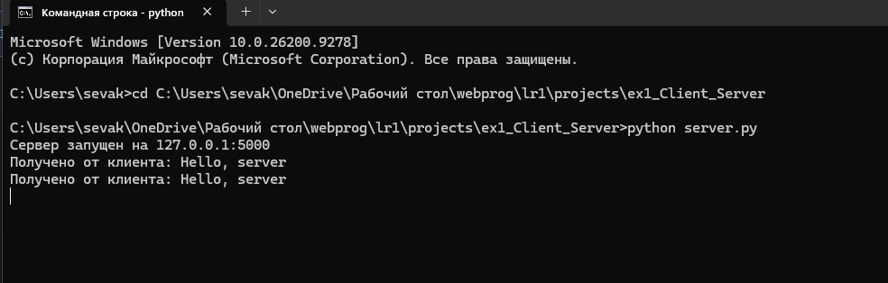
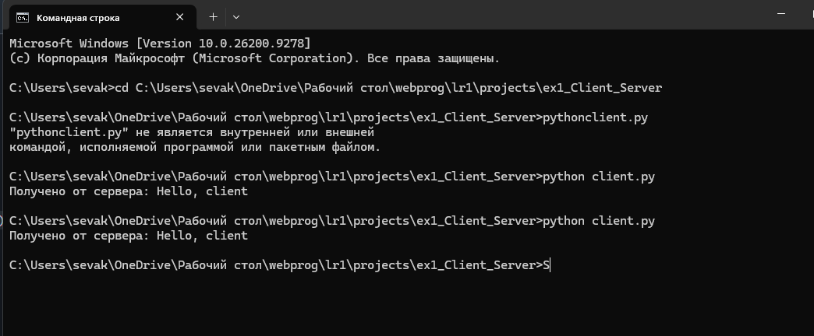
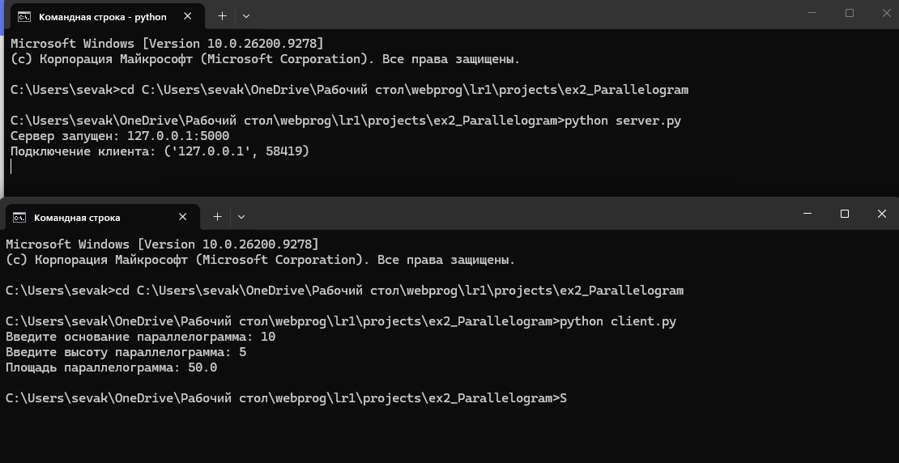
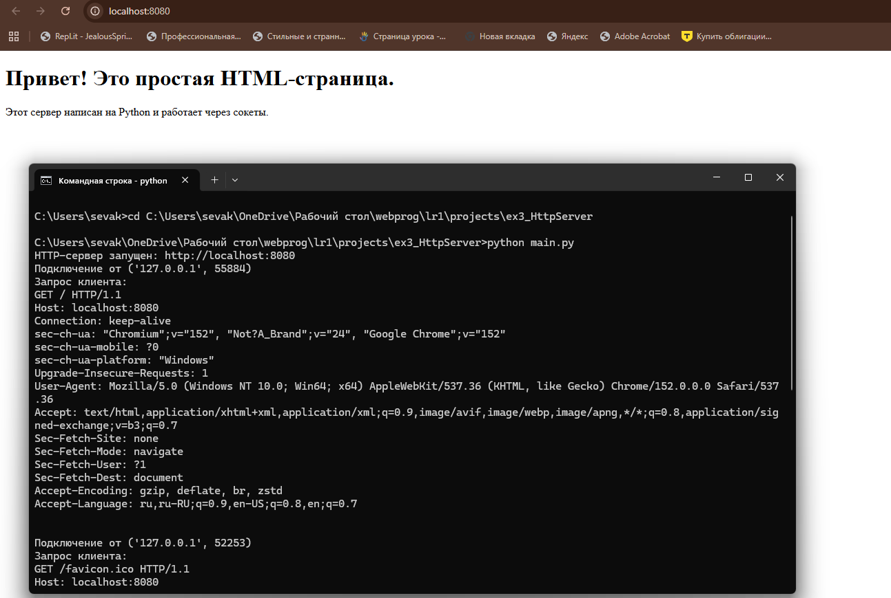
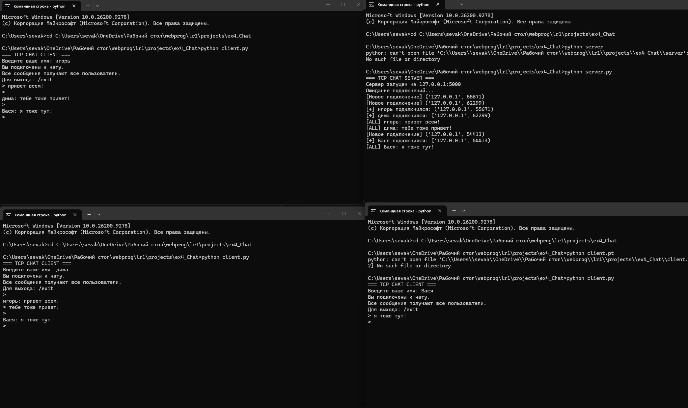
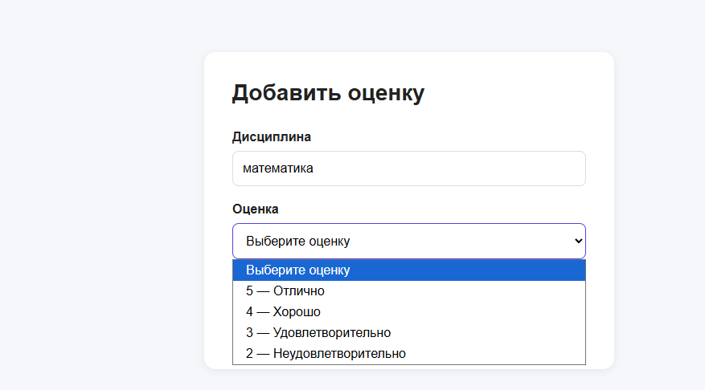
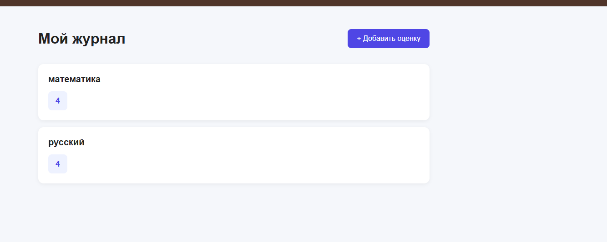

# Лабораторная работа 1. Работа с сокетами

## Задание 1

**Дано: Реализовать клиентскую и серверную часть приложения. Клиент отправляет серверу сообщение «Hello, server», и оно должно отобразиться на стороне сервера. В ответ сервер отправляет клиенту сообщение «Hello, client», которое должно отобразиться у клиента. Обязательно использовать библиотеку socket  + UDP.**

### Описание решения

Что нужно знать про udp протокол: UDP протокол - протокол без соединения. Отправитель посылает датаграмму, не дожидаясь подтверждения от получателя. Минусы этого подхода: UDP не гарантирует ни доставку, ни порядок пакетов, зато такой подход быстрее чем TCP.

Для выполнения задания были созданы два файла:
- `server.py` — серверная часть приложения
- `client.py` — клиентская часть приложения

**Серверная часть**

Серверная часть выполняет следующие функции:

1. Создает UDP сокет с использованием `socket.SOCK_DGRAM`
2. Привязывается к адресу `localhost` и порту `5000`
3. Ожидает входящее сообщение от клиента методом `recvfrom()`
4. Выводит полученное сообщение в консоль
5. Отправляет ответное сообщение "Hello, client" клиенту
6. Закрывает соединение

**Клиентская часть**

Клиентская часть выполняет следующие функции:

1. Создает UDP сокет
2. Отправляет сообщение "Hello, server" на адрес сервера методом `sendto()`
3. Ожидает ответ от сервера методом `recvfrom()`
4. Выводит полученное сообщение в консоль
5. Закрывает соединение


### Запуск приложения

Для проверки работы приложения необходимо:

1. Запустить сервер:
```bash
python3 server.py
```

2. В отдельном терминале запустить клиент:
```bash
python3 client.py
```

### Результаты выполнения

**Вывод сервера:**



**Вывод клиента:**



### Выводы

В ходе выполнения задания была реализована базовая модель клиент-серверного взаимодействия с использованием протокола UDP. Основные отличия UDP от TCP:

- UDP не требует установки соединения
- Отсутствует гарантия доставки пакетов
- Меньшие накладные расходы по сравнению с TCP
- Подходит для приложений, где скорость важнее надежности

## Задание 2

**Цель: Реализовать клиентскую и серверную часть приложения. Клиент запрашивает выполнение математической операции, параметры которой вводятся с клавиатуры. Сервер обрабатывает данные и возвращает результат клиенту. Вариант 4 - Поиск площади параллелограмма**

### Описание решения

Для выполнения задания были созданы два файла:
- `server.py` — серверная часть приложения
- `client.py` — клиентская часть приложения

**Серверная часть**

- Создает TCP-сокет с использованием socket.SOCK_STREAM.
- Привязывается к адресу localhost и порту 5000.
- Переходит в режим ожидания входящих подключений с помощью метода listen(5).
- Принимает входящее TCP-соединение от клиента методом accept().
- Получает от клиента данные, содержащие параметры параллелограмма: основание a и высоту h.
- Преобразует полученные данные из байтового формата в строку с помощью decode("utf-8") и извлекает значения a и h.
- Вычисляет площадь параллелограмма по формуле: S = a * h
- Преобразует полученный результат в строку и отправляет его обратно клиенту с помощью метода send().
- После завершения обмена данными закрывает соединение с клиентом методом close().

**Формат данных:**

Для передачи параметров используется строковое представление двух чисел (основание a и высоту h). Например, "10 5".


**Клиентская часть**

- Создает TCP-сокет с использованием socket.SOCK_STREAM.
- Устанавливает TCP-соединение с сервером методом connect().
- Запрашивает у пользователя значение основания параллелограмма a.
- Запрашивает у пользователя значение высоты параллелограмма h.
- Выполняет преобразование введенных значений из строкового типа в числовой тип float.
- Формирует сообщение с параметрами a и h для передачи серверу.
- Отправляет параметры параллелограмма серверу с помощью метода send().
- Ожидает результат вычисления от сервера с помощью метода recv().
- Преобразует полученные байты обратно в строку с помощью decode("utf-8").
- Выводит полученную площадь параллелограмма на экран.
- Закрывает TCP-соединение методом close().

**Обработка ошибок:**

- Валидация числовых значений
- Проверка на положительные значения катетов

### Пример работы

**Входные данные:**
- Основание a = 10
- Высота h = 5

**Ожидаемый результат:**
- Площадь = 50

### Результаты выполнения

**Вывод сервера и клиента**



### Выводы

В ходе выполнения задания была реализована клиент-серверная модель с использованием протокола TCP для выполнения математических вычислений по поиску  площади параллелограмма.

## Задание 3

**Дано: Реализовать серверную часть приложения. Клиент подключается к серверу и в ответ получает HTTP-сообщение, содержащее HTML-страницу, которую сервер подгружает из файла index.html Обязательно использовать библиотеку socket.**

### Описание решения

Для выполнения задания были созданы два файла:
- `main.py` — HTTP-сервер на базе библиотеки socket
- `index.html` — HTML-страница для отображения в браузере

Серверная часть выполняет следующие функции:

1. **Создание и настройка сокета:**
   - Создает TCP сокет (`SOCK_STREAM`)
   - Устанавливает опцию `SO_REUSEADDR` для повторного использования адреса
   - Привязывается к адресу `localhost:8080`

2. **Обработка подключений:**
   - Слушает входящие соединения методом `listen(5)`
   - Принимает подключения от клиентов (браузеров)
   - Читает HTTP-запрос от клиента

3. **Загрузка HTML-контента:**
   - Проверяет существование файла `index.html`
   - Читает содержимое файла в кодировке UTF-8

4. **Формирование HTTP-ответа:**
   - Создает статус-линию `HTTP/1.1 200 OK`
   - Добавляет необходимые заголовки:
     - `Content-Type: text/html; charset=utf-8`
     - `Content-Length` с длинной контента
     - `Connection: close`
   - Присоединяет HTML-контент в качестве тела ответа

5. **Отправка ответа и закрытие соединения:**
   - Отправляет HTTP-ответ клиенту методом `sendall()`
   - Закрывает соединение с текущим клиентом
   - Продолжает ожидать новые подключения


Пример работы:


### Выводы

В ходе выполнения задания был реализован простой HTTP-сервер с использованием низкоуровневой библиотеки `socket`. Основные достижения:

1. **Понимание HTTP-протокола:**
   - Структура HTTP-запросов и ответов
   - Роль заголовков в передаче метаданных
   - Статус-коды и их значение

2. **Работа с файловой системой:**
   - Чтение HTML-файлов с диска
   - Обработка ошибок при отсутствии файлов
   - Корректная работа с кодировкой UTF-8

3. **Многопользовательская обработка:**
   - Последовательная обработка множественных подключений
   - Корректное закрытие соединений
   - Возможность работы в бесконечном цикле

## Задание 4

**Дано: Реализовать многопользовательский чат.**

Требования:
Обязательно использовать библиотеку socket.
Для многопользовательского чата необходимо использовать библиотеку threading.
Должна быть возможность идентифицировать пользователей.
Пользователь должен иметь возможность выйти из чата.
Реализация:
Для TCP запустите обработку подключений и сообщений от всех пользователей в потоках. Не забудьте сохранять пользователей, чтобы отправлять им сообщения.

### Описание решения

Для выполнения задания были созданы два файла:
- `server.py` — серверная часть многопользовательского чата
- `client.py` — клиентская часть для подключения к чату

**Принцип работы:**
1. Сервер создает основной TCP сокет и ожидает подключений на `localhost:5000`
2. При подключении нового клиента создается отдельный поток для его обработки
3. Каждый клиент работает в своем потоке независимо от других
4. Сообщения от любого клиента рассылаются всем участникам чата (broadcast)
5. Клиент имеет два потока: один для приема сообщений от сервера, другой для отправки собственных сообщений

## Серверная часть

#### Основные компоненты:


**1. Хранение данных о клиентах:**
```python
clients = {}  # Словарь {сокет: никнейм} для хранения подключенных клиентов
lock = threading.Lock()  # Блокировка для безопасного доступа из разных потоков
```

**2. Функция broadcast(message, sender_socket)**

- Принимает сообщение и сокет отправителя
- С помощью lock безопасно получает список всех подключенных клиентов из словаря clients
- Создаёт копию списка сокетов, чтобы не удерживать блокировку во время отправки сообщений
- Проходит по всем подключенным клиентам
- Не отправляет сообщение самому отправителю
- Отправляет сообщение каждому остальному клиенту через его сокет

**3. Функция handle_client(client_socket, address)**

- Выполняется в отдельном потоке для каждого подключенного клиента
- С lock добавляет клиента и его никнейм в словарь clients
- В бесконечном цикле принимает сообщения от клиента через client_socket.recv(1024)
- Если получено пустое сообщение, завершает работу с клиентом
- Если получена команда /exit, завершает работу с клиентом
- Обычные сообщения передает в функцию broadcast()
- При потере соединения обрабатывает исключение ConnectionResetError
- В блоке finally безопасно удаляет клиента из словаря с помощью lock
- Закрывает сокет клиента после отключения

**4. Функция start_server()**

- Создает серверный TCP-сокет
- Привязывает сервер к адресу 127.0.0.1:5000
- В бесконечном цикле ожидает новые подключения через accept()
- При подключении нового клиента получает его сокет и адрес
- Для каждого нового клиента создает отдельный поток
- Передает в поток функцию handle_client() с сокетом и адресом клиента
- Благодаря отдельным потокам сервер может одновременно обслуживать нескольких клиентов

**5. Завершение работы клиента**

- При получении команды /exit клиент выходит из цикла обработки сообщений
- При закрытии соединения recv() возвращает пустую строку
- При неожиданном разрыве соединения возникает ConnectionResetError
- Клиент удаляется из словаря clients
- Его сокет закрывается

## Клиентская часть

#### Основные компоненты:

**1. Инициализация**
```python
client_socket = socket.socket(
    socket.AF_INET,
    socket.SOCK_STREAM
)

client_socket.connect(
    (HOST, PORT)
)
```
- Создает клиентский TCP-сокет
- Использует SOCK_STREAM для TCP
- Подключается к серверу по адресу 127.0.0.1:5000
- Запрашивает имя пользователя через input()
- Кодирует имя в UTF-8 и отправляет его серверу

**2. Функция receive_messages(client_socket)**

- Выполняется в отдельном потоке
- В бесконечном цикле принимает сообщения от сервера через client_socket.recv(1024)
- Если получено пустое сообщение, завершает работу функции
- Выводит полученное сообщение в консоль
- При ошибке соединения (ConnectionResetError, ConnectionAbortedError, OSError) завершает работу функции

**3. Функция start_client()**

- Создает TCP-сокет клиента
- Подключается к серверу
- Запрашивает и отправляет имя пользователя серверу
- Создает отдельный поток для функции receive_messages()
- Запускает поток приема сообщений
- В основном потоке ожидает ввод сообщений от пользователя

### Результат

**Реализован полнофункциональный многопользовательский TCP-чат, который:**

- Поддерживает одновременное подключение нескольких пользователей
- Позволяет каждому пользователю задавать собственное имя
- Использует многопоточную архитектуру для параллельной обработки клиентов
- Позволяет одновременно отправлять и получать сообщения благодаря отдельному потоку приема
- Использует threading.Lock() для потокобезопасной работы с общим словарём подключенных клиентов
- Реализует широковещательную рассылку сообщений всем участникам, кроме отправителя
- Использует TCP-сокеты для надежной передачи данных между клиентами и сервером

**Вывод сервера и клиентов в консоли**



## Задание 5

**Написать простой веб-сервер для обработки GET и POST HTTP-запросов с помощью библиотеки socket в Python. Сервер должен:**

- Принимать и записывать информацию о дисциплине и оценке по дисциплине.
- Отдавать информацию обо всех оценках по дисциплинам в виде HTML-страницы.

**Для выполнения задания был создан файл:**

- server.py — HTTP-сервер с поддержкой GET и POST-запросов.

**HTML-страницы вынесены в отдельную папку:**

- grades.html — страница со всеми оценками;
- add_grade.html — форма добавления оценки;
- success.html — страница подтверждения добавления оценки.

**Сервер предоставляет следующие маршруты:**

- GET / → автоматическое перенаправление на /grades;
- GET /grades/add → форма для добавления оценки;
- POST /grades → обработка и сохранение оценки;
- GET /grades → отображение всех сохранённых оценок.

### Принцип работы

1. Сервер создаёт TCP-сокет и начинает прослушивать порт 8080.
2. При подключении клиента сервер принимает HTTP-запрос.
3. Запрос разбирается на метод, URL, версию HTTP, заголовки и тело.
4. В зависимости от метода и пути выбирается соответствующий обработчик.
5. Оценки хранятся в памяти в виде словаря {дисциплина: список оценок}.
6. Для отображения страниц сервер загружает готовые HTML-файлы из папки files.
7. Динамические данные вставляются в HTML с помощью замены специальных маркеров.
8. Сформированный HTML отправляется клиенту в HTTP-ответе.
9. При обращении к / сервер возвращает статус 302 Found и перенаправляет пользователя на /grades.

### Архитектура решения

**Класс Request**

dataclass, предназначенный для хранения параметров HTTP-запроса:

- метод запроса;
- URL;
- версия HTTP;
- заголовки;
- тело запроса.

Также класс предоставляет свойства для получения пути и параметров URL.

**Класс MyHTTPServer**

Основной класс приложения, отвечающий за весь жизненный цикл HTTP-соединения:

- запуск TCP-сервера;
- принятие подключений;
- разбор HTTP-запросов;
- маршрутизацию;
- обработку GET и POST;
- формирование HTTP-ответов;

**Основные методы сервера**

- serve_forever() — запускает сервер, открывает сокет, ожидает подключения клиентов и передаёт их на обработку.
- parse_request() — получает HTTP-запрос от клиента и разбирает его на метод, адрес, заголовки и тело запроса.
- handle_request() — определяет, какой маршрут был запрошен, и вызывает соответствующую обработку:
GET /grades — просмотр оценок;
GET /grades/add — форма добавления;
POST /grades — добавление оценки.
- handle_get_grades() / handle_post_grades() — основные методы работы с оценками:
- handle_get_grades() формирует страницу со всеми оценками;
- handle_post_grades() получает данные формы и сохраняет новую оценку.
- send_response() — формирует и отправляет клиенту HTTP-ответ с кодом статуса, заголовками и HTML-страницей.

### Маршруты сервера

| Метод | Путь | Описание |
|-------|------|----------|
| GET | `/grades/add` | Форма для добавления оценки |
| POST | `/grades` | Сохранение новой оценки |
| GET | `/grades` | Просмотр всех оценок |
| GET | `/` | Пересылает на просмотр всех оценок |

### HTML-страницы

**Форма добавления оценки:**

- Поле для ввода названия дисциплины
- Выпадающий список для выбора оценки (2, 3, 4, 5)
- Кнопка отправки формы
- Ссылка на страницу со всеми оценками

**Страница со всеми оценками:**

- Отображение оценок, сгруппированных по дисциплинам
- Динамическое формирование блоков на основе данных словаря
- Сообщение «Оценок пока нет», если оценок нет
- Ссылка на форму добавления оценки

**Страница подтверждения:**

- Отображается после успешного добавления оценки
- Показывает добавленную дисциплину и оценку
- Ссылка для добавления ещё одной оценки
- Ссылка на просмотр всех оценок


### Результаты выполнения

**Форма добавления оценки:**



**Страница со всеми оценками:**



### Выводы

В ходе выполнения задания был реализован HTTP-сервер с полноценной обработкой GET и POST запросов на низком уровне с использованием библиотеки `socket`.
